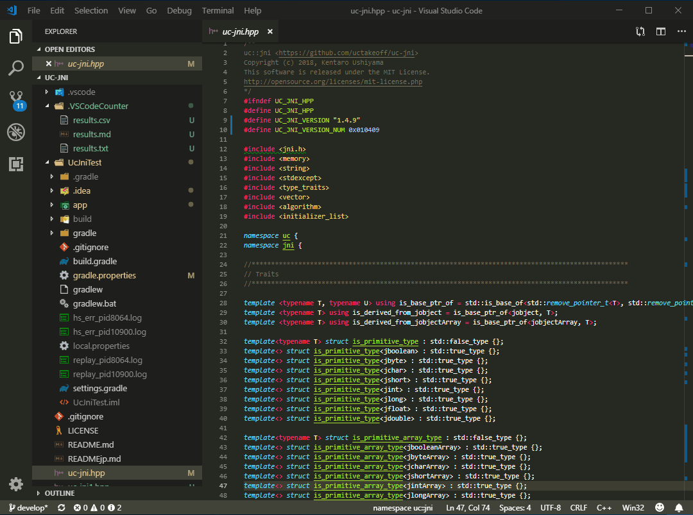
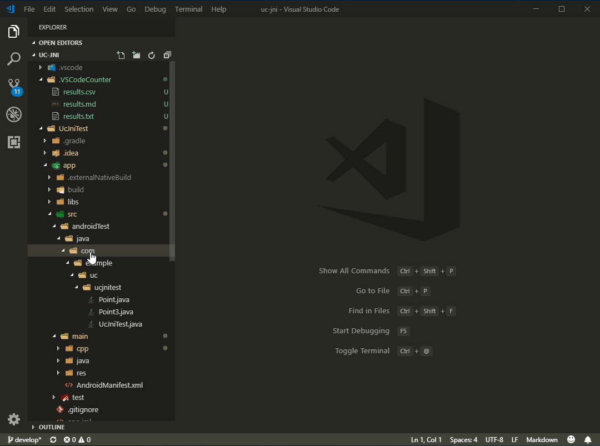
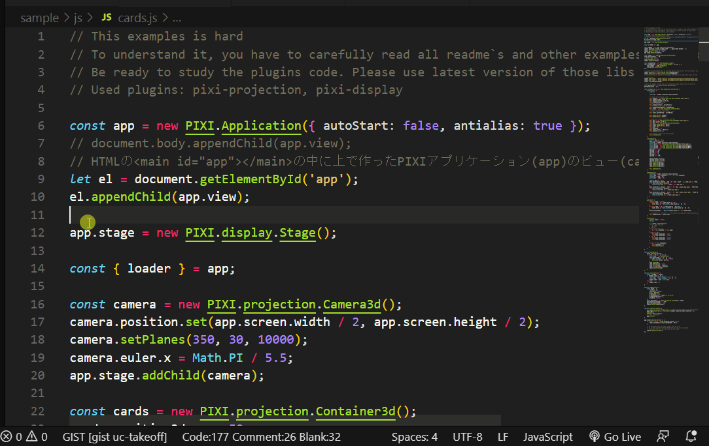
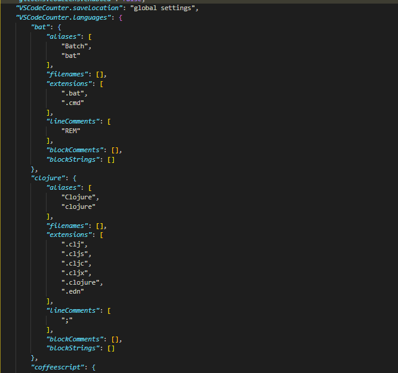

# VScode Counter

VS Code extension: counts blank lines, comment lines, and physical lines of source code in many programming languages.

* [github](https://github.com/uctakeoff/vscode-counter)
* [Marketplace](https://marketplace.visualstudio.com/items?itemName=uctakeoff.vscode-counter)

This extension uses other language extensions to determine the line of code.Therefore, you may need to install the language extension to support a new language.

Conversely, as the number of language extensions increases, the range of support for this feature also increases.

## VSCode Counter 2.0 is released!

* Experimental support for "**VSCode Remote Development**".

    When using VSCode Counter in *VSCode Remote Development*, use the `Save language configurations` function You will need to. 
    [See below for more information](#save-language-configurations).

## Features

- Count the code lines of source code in workspace or directory.
- Count the code lines of the current file in real time.

## Usage

### Count in workspace

* Open the command palette and select  `VSCodeCounter: Count lines in workspace`.

    

### Count in any directory

* Open Explorer and right click on the folder.
* Select `Count lines in directory`.

    

### Real-time counter

* Open the command palette and select  `VSCodeCounter: Toggle Real-time Counter Visibility`.

    

* Count the range of the selected text

    

### Check available languages

* Open the command palette and select  `VSCodeCounter: Check available languages`.
    

    * Available languages can be increased by adding language extensions.

### Save language configurations

**VSCode Counter** is able to aggregate in unknown languages by referring to the information in the installed language extensions. However, I found out that **this information is not available in Remote Development**.

Therefore, VSCode Counter's ability of **collecting VSCode language extensions** is now called as an independent function. The idea is to collect the information once in the local environment and store it so that it can be used remotely.

* First, launch VSCode on your local.
* Then, open the command palette and select  `VSCodeCounter: Save the collected language configurations`.
* Then *settings.json* will store the configuration information collected from the current language extensions .
    
* Connect to the remote and use the VSCodecounter as usual.

You can also change the location where your configurations are stored.
However, you must carry the stored information to the remote environment by yourself.

## Extension Settings

* `VSCodeCounter.useGitignore`: Whether to use '.gitignore' files for excluding files.
* `VSCodeCounter.useFilesExclude`: Whether to use setting 'files.exclude' for excluding files.
* `VSCodeCounter.maxOpenFiles`: Maximum number of files that VSCodeCounter can read simultaneously.
* `VSCodeCounter.printNumberWithCommas`: Whether to print a number with commas as thousands separators.(except for CSV)
* `VSCodeCounter.ignoreUnsupportedFile`: Ignore unsupported files.
* `VSCodeCounter.endOfLine`: A new line character to be used in the output file.
* `VSCodeCounter.include`: Configure glob patterns for including files and folders.
* `VSCodeCounter.exclude`: Configure glob patterns for excluding files and folders.
* `VSCodeCounter.outputDirectory`: Directory path for outputting results.
* `VSCodeCounter.outputAsText`: Whether to output the result as a text file.
* `VSCodeCounter.outputAsCSV`: Whether to output the result as a CSV file.
* `VSCodeCounter.outputAsMarkdown`: Whether to output the result as a Markdown file.
* `VSCodeCounter.outputPreviewType`: Type of output file to preview after counting. Choose from `text`, `csv`, `markdown`, `diff-text`, `diff-csv`, `diff-markdown` or `none`.
* `VSCodeCounter.saveLocation`: Specify where to store the collected language configurations.
* `VSCodeCounter.history`: Controls the number of recent result to keep in history.

**Enjoy!**